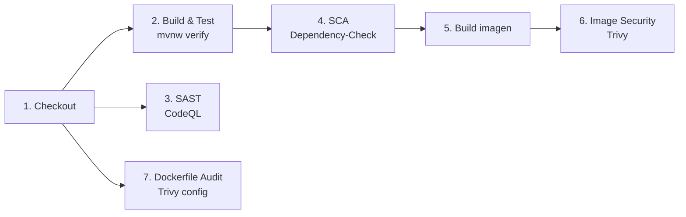

# Pipeline DevSecOps

Fork de [petclinic](https://github.com/Taller-DevSecOps/pet-clinic) con CI/CD en GitHub Actions que integra SAST, SCA e Image Security. El pipeline *bloquea el avance* ante hallazgos de severidad **Critical/High/Medium** en código, dependencias e imagen Docker.

## Arquitectura

Dos workflows:
- [`.github/workflows/ci-security.yml`](.github/workflows/ci-security.yml) — jobs `build-and-test`, `sca`, `image`, `dockerfile`.
- [`.github/workflows/codeql.yml`](.github/workflows/codeql.yml) — job `sast`.

| Etapa | Herramienta | Analiza | Falla si |
|---|---|---|---|
| 1. Checkout | `actions/checkout` | — | — |
| 2. Build & Test | `./mvnw verify` (JDK 8, Temurin) | Compila, testea, publica `.jar` como `app-jar` | Falla compilación/test → salta etapas 4-6 |
| 3. SAST | CodeQL | `src/main` Java | Critical/High/Medium |
| 4. SCA | OWASP Dependency-Check | Dependencias del `.jar` | CVEs Critical/High/Medium |
| 5. Build imagen | `docker build` | Empaqueta el `.jar` | — |
| 6. Image Security | Trivy | Paquetes OS de la imagen | CVEs Critical/High/Medium con parche |
| 7. Dockerfile Audit | Trivy config | Buenas prácticas del `Dockerfile` | Malas configs Critical/High/Medium |

## Triggers

| Job | `push` | `pull_request → main` | `schedule` |
|---|---|---|---|
| `build-and-test`, `dockerfile` | cualquier rama | ✔ | lunes 06:00 UTC |
| `sca`, `image` | solo `main` | ✔ | lunes 06:00 UTC |
| `sast` | solo `main` | ✔ | lunes 06:30 UTC |

- `Schedule semanal`: el análisis por evento no detecta CVEs publicadas después del último commit.
- `build-and-test`/`dockerfile` en todas las ramas: dan feedback temprano.
- `concurrency` + `cancel-in-progress` cancela runs previos de la misma rama
- `paths-ignore` evita disparar el pipeline al editar markdown.

## Detalle por etapa

### 3. SAST — CodeQL
Ejecuta `./mvnw clean compile` y cubre ficheros Java de `src/main`, sin `package-info.java` ni tests, ya que `compile` no alcanza `src/test` (el código de test solo generaría ruido).

**Gate propio**: `sast` no falla por hallazgos — no tiene input de umbral, solo publica alertas en Code scanning y devuelve 0 (falla únicamente si el build o el upload se rompen). Por eso se escribe además el SARIF a disco y un paso posterior lo evalúa con jq contra THRESHOLD=4.0 sobre el security-severity de cada regla (7.0 = solo High/Critical; 9.0 = solo Critical).

### 4. SCA — OWASP Dependency-Check
Descarga `app-jar`, resuelve dependencias contra la NVD (`--enableRetired --disableCentral`).

**Gate**: el default de `--failOnCVSS` es 11 (nunca falla, CVSS máximo es 10), por eso se fija explícito en `--failOnCVSS 4`, alineado al `THRESHOLD` del SAST. `image` depende de `sca` (`needs`), así que un gate en rojo también salta la etapa 6.

### 5. Build de la imagen
Descarga `app-jar` a `target/` (`COPY target/*.jar` en el Dockerfile), construye `spring-petclinic:${{ github.sha }}`. No se publica a ningún registry — Trivy la lee del daemon local, por eso comparte job con la etapa 6. Un futuro `docker push` iría después del gate 6.

### 6. Image Security — Trivy
Cubre lo que otros jobs no ven: paquetes OS de la imagen base.

| Parámetro | Efecto |
|---|---|
| `vuln-type: 'os'` | Evita duplicar hallazgos de la etapa 4 |
| `severity` + `limit-severities-for-sarif: true` | Aplica umbral Critical/High/Medium |
| `ignore-unfixed: true` | Solo CVEs con parche disponible |
| `exit-code: '1'` | Convierte hallazgo en fallo del step |

**Gate** (`exit-code: '1'`): un hallazgo sobre el umbral falla el step y con él el job, así que la imagen queda construida pero nunca llega a publicarse. El SARIF se sube igual por el `if: always()`.

### 7. Dockerfile Audit — Trivy config
Evalúa el `Dockerfile` contra políticas, no CVEs. En estos checks, "≥ Medium" equivale en la práctica a *todo menos LOW*. Job independiente sin `needs`, corre en paralelo desde el minuto uno. Como ningún job declara `needs: dockerfile`, el fallo no salta etapas, solo marca el run en rojo.

**Gate** (`exit-code: '1'`): cualquier hallazgo sobre el umbral convierte el escaneo en fallo del step, y `severity` + `limit-severities-for-sarif` fijan ese umbral. El SARIF se publica igual porque el upload lleva `if: always()`.

## Configuración segura del pipeline

| Medida | Motivo |
|---|---|
| Actions fijadas por SHA | El mantenedor puede cambiar el código detrás de un tag sin avisar, y ese código accede al workspace y secrets. |
| [Dependabot](.github/dependabot.yml) sobre `github-actions` | Un SHA fijo no recibe arreglos de seguridad por sí solo |
| `persist-credentials: false` en checkout | Evita que el token quede en `.git/config` |
| `permissions` mínimos por job | `contents: read` global; `security-events: write` solo donde se sube SARIF |
| `timeout-minutes` en todos los jobs | Acota un job colgado |
| `retention-days` acotado | `app-jar`: 1 día (intermedio entre jobs). `reportes-test`/`sca-report`: 7 días (cubre un fin de semana largo). El registro durable es Code scanning, no los artifacts |
| `if: always()` en publicaciones | La evidencia se publica aunque el gate rompa el build |