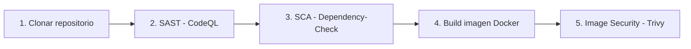

# Pipeline DevSecOps

Fork de [petclinic](https://github.com/Taller-DevSecOps/pet-clinic) con un pipeline de CI/CD en GitHub Actions que integra controles de seguridad automatizados (SAST, SCA e Image Security) sobre el ciclo de build de la aplicación (Java 8, Maven, Spring Boot 2.6.6).

## Objetivo

Implementar un pipeline que no solo compile y empaquete la aplicación, sino que **bloquee el avance** cuando se detecten vulnerabilidades de severidad crítica, alta o media en:

- el código fuente del proyecto (SAST),
- las dependencias declaradas en `pom.xml` (SCA),
- la imagen Docker final (Image Security).

## Arquitectura del pipeline

Los controles viven en dos workflows: [`.github/workflows/ci-security.yml`](.github/workflows/ci-security.yml) (build, tests, SCA) y [`.github/workflows/codeql.yml`](.github/workflows/codeql.yml) (SAST). Se disparan automáticamente en cada `push` y en cada `pull_request` hacia `main`.



| Etapa | Herramienta | Qué analiza | Condición de fallo |
|---|---|---|---|
| 1. Clonación | `actions/checkout` | Trae el código al runner | — |
| 2. SAST | [CodeQL](https://codeql.github.com/) | Código fuente Java | Falla si hay hallazgos **Critical / High / Medium** en el Quality Gate |
| 3. SCA | [OWASP Dependency-Check](https://owasp.org/www-project-dependency-check/) | Dependencias embebidas en el `.jar` descargado del artifact `app-jar` | Falla si hay CVEs con severidad **Critical / High / Medium** |
| 4. Build imagen | `docker build` (usa el [Dockerfile](Dockerfile) del repo) | Empaqueta el `.jar` generado por Maven | — |
| 5. Image Security | [Trivy](https://github.com/aquasecurity/trivy) | Imagen Docker (OS packages + librerías Java embebidas) | Falla si hay vulnerabilidades **Critical / High / Medium** |

## Configuración de cada etapa

### 2. SAST — CodeQL

Análisis estático del código fuente Java con [CodeQL](https://codeql.github.com/).
Workflow: [`.github/workflows/codeql.yml`](.github/workflows/codeql.yml).

#### Alcance

CodeQL analiza **22 de 34** ficheros Java: los 23 de `src/main` (menos `package-info.java`, sin código extraíble) y **ninguno** de `src/test`. Es intencional — `compile` solo abarca `src/main`; incluir los tests requeriría `test-compile`. Se excluyen porque el código de test no se despliega y genera ruido en un SAST.

#### Validación de la detección (vulnerabilidad forzada)

Para comprobar que el análisis realmente detecta, se introdujo **a propósito** una vulnerabilidad conocida en `OwnerController` (commit `30bf23b`): un endpoint que leía un fichero a partir de un parámetro HTTP sin sanear.

```java
@GetMapping("/owners/report")
@ResponseBody
public String downloadReport(@RequestParam String name) throws IOException {
    File report = new File(REPORTS_DIR, name);           
    return new String(Files.readAllBytes(report.toPath()), StandardCharsets.UTF_8);
}
```

Una petición como `/owners/report?name=../../../../etc/passwd` escapa del directorio base y lee ficheros arbitrarios del servidor.

- **Hallazgo:** `java/path-injection` — *Uncontrolled data used in path expression*.
- **Severidad:** 7.5 (**High**).
- **Resultado:** CodeQL la reportó correctamente. Una vez confirmada la detección, la vulnerabilidad se **revirtió por completo** (commit `c143519`).

#### Vulnerabilidad real encontrada y corregida

Además de la forzada, CodeQL detectó una vulnerabilidad **preexistente** en el proyecto:

- **Hallazgo:** `java/spring-boot-exposed-actuators-config` — *Exposed Spring Boot actuators in configuration file*.
- **Severidad:** 6.5 (**Medium**).
- **Causa:** [`application.properties`](src/main/resources/application.properties) tenía `management.endpoints.web.exposure.include=*`, que expone **todos** los endpoints de actuator sin autenticación (`/actuator/env`, `/heapdump`, `/beans`…), con riesgo de fuga de información.

El primer intento (commit `f444405`) cambió el valor a `health,info`. Es correcto en seguridad, **pero la alerta no se cerró**: el query compara el valor como string literal (`not ep.getValue() = ["health", "info"]`, que solo acepta exactamente `health` o exactamente `info`), y no reconoce la lista separada por comas. La corrección definitiva (commit `98503b4`) fue **eliminar la propiedad**: sin exposición explícita, Spring Boot 2.x usa su default seguro (solo `health`/`info`) y el query deja de disparar.

> **Aprendizaje.** Un SAST puede seguir marcando código que es seguro en la práctica porque
> razona sobre patrones literales, no sobre semántica. Las salidas son tres: ajustar el código
> al patrón que la regla reconoce (lo aplicado aquí), *dismiss* manual justificado, o añadir
> `spring-boot-starter-security` (que el query también acepta como mitigación).

#### Quality gate: bloqueo del pipeline

Por defecto el paso `analyze` de CodeQL **nunca falla** y publica los hallazgos en Code scanning. Para que el pipeline **bloquee** ante vulnerabilidades se añadió un paso de _quality gate_ (commit `8de27c8`): `analyze` escribe el SARIF a disco (`output: sarif-results`, sin dejar de subirlo con `upload: always`) y un paso posterior lo evalúa con `jq`.

CodeQL asigna a cada regla un valor `security-severity`. El gate rompe el build si algún hallazgo iguala o supera el umbral, el cual es una variable del step (`THRESHOLD=4.0`). Al establecerlo en `4.0` bloquea desde Medium, al subirlo a `7.0` bloquea solo High/Critical, y a `9.0` solo Critical.

#### Resultados 

Los hallazgos se publican en **[Security → Code scanning](https://github.com/daedov/pet-clinic/security/code-scanning)**. La vista filtra por rama (`branch:`); las alertas corregidas quedan como *Closed*.

### 3. SCA — OWASP Dependency-Check

El job `sca` analiza el artefacto construido en `build-and-test` (el jar descargado en `app/`) y resuelve sus dependencias contra la base de datos de la NVD. Publica dos salidas: el reporte HTML como artifact (`sca-report`) y el SARIF en Code scanning bajo la categoría `sca`.

#### Quality gate: bloqueo del pipeline

Dependency-Check decide su código de salida con `--failOnCVSS <score>`, cuyo **default es 11**. Como CVSS solo llega a 10, sin ese flag el paso **nunca falla** por muy críticas que sean las CVEs encontradas. El gate se activa pasando el umbral explícitamente en `args`. El umbral vive en el flag del step (`--failOnCVSS 4`), alineado con el `THRESHOLD=4.0` del gate de SAST: subirlo a `7` bloquea solo High/Critical, y a `9` solo Critical.

Los pasos de publicación llevan `if: always()`, así que cuando el gate rompe el build el reporte HTML y el SARIF se suben igual — el fallo no deja al equipo sin evidencia de qué lo causó.

#### Resultados

Hay dos salidas, ambas subidas con `if: always()`:

- **[Security → Code scanning](https://github.com/daedov/pet-clinic/security/code-scanning)** — el SARIF se publica bajo la categoría `sca`, así que conviene filtrar por herramienta para separarlo de los hallazgos de CodeQL. La vista filtra por rama (`branch:`); las alertas corregidas quedan como *Closed*.
- **Artifact `sca-report`** — contiene `dependency-check-report.html` con el detalle por dependencia: CVEs, CVSS y evidencia de identificación. 

### 4. Build de la imagen Docker


### 5. Image Security — Trivy