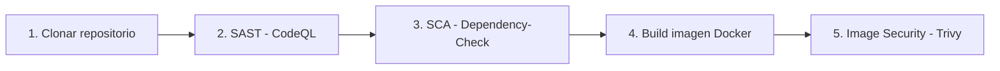

# Pipeline DevSecOps

Fork de [petclinic](https://github.com/Taller-DevSecOps/pet-clinic) con un pipeline de
CI/CD en GitHub Actions que integra controles de seguridad automatizados (SAST, SCA e Image Security) sobre el ciclo de build de la aplicación (Java 8, Maven, Spring Boot 2.6.6).

## Objetivo

Implementar un pipeline que no solo compile y empaquete la aplicación, sino que **bloquee el avance** cuando se detecten vulnerabilidades de severidad crítica, alta o media en:

- el código fuente del proyecto (SAST),
- las dependencias declaradas en `pom.xml` (SCA),
- la imagen Docker final (Image Security).

## Arquitectura del pipeline

Workflow: [`.github/workflows/security-pipeline.yml`](.github/workflows/security-pipeline.yml)

Se dispara automáticamente en cada `push` a cualquier rama y en cada `pull_request` hacia `main`.

| Etapa | Herramienta | Qué analiza | Condición de fallo |
|---|---|---|---|
| 1. Clonación | `actions/checkout` | Trae el código al runner | — |
| 2. SAST | [CodeQL](https://codeql.github.com/) | Código fuente Java | Falla si hay hallazgos **Critical / High / Medium** en el Quality Gate |
| 3. SCA | [OWASP Dependency-Check](https://owasp.org/www-project-dependency-check/) | Dependencias resueltas por Maven (`pom.xml`) | Falla si hay CVEs con severidad **Critical / High / Medium** |
| 4. Build imagen | `docker build` (usa el [Dockerfile](Dockerfile) del repo) | Empaqueta el `.jar` generado por Maven | — |
| 5. Image Security | [Trivy](https://github.com/aquasecurity/trivy) | Imagen Docker (OS packages + librerías Java embebidas) | Falla si hay vulnerabilidades **Critical / High / Medium** |

## Configuración de cada etapa

### 2. SAST — CodeQL

### 3. SCA — OWASP Dependency-Check

### 4. Build de la imagen Docker

### 5. Image Security — Trivy

